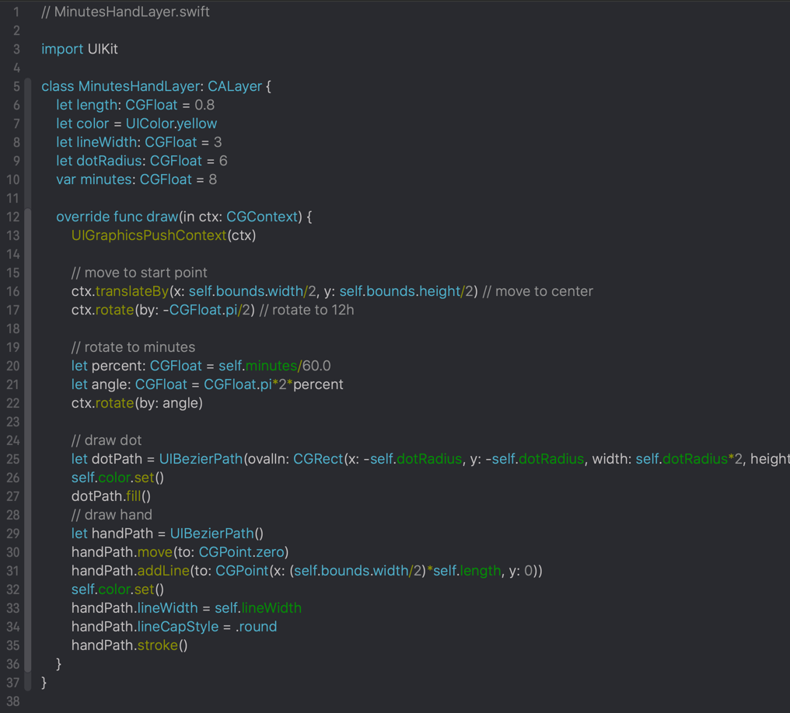
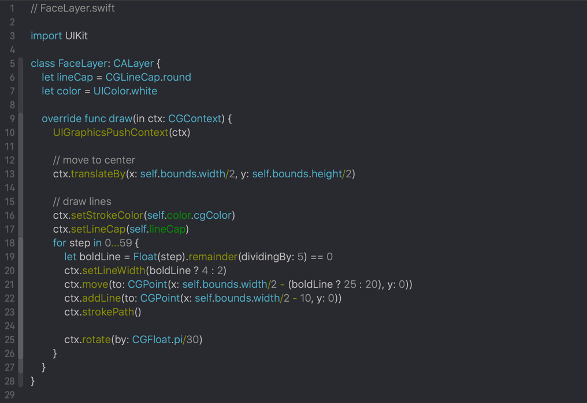
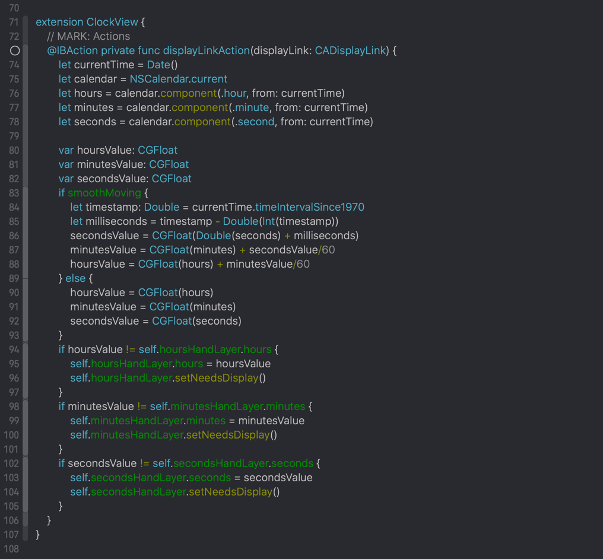
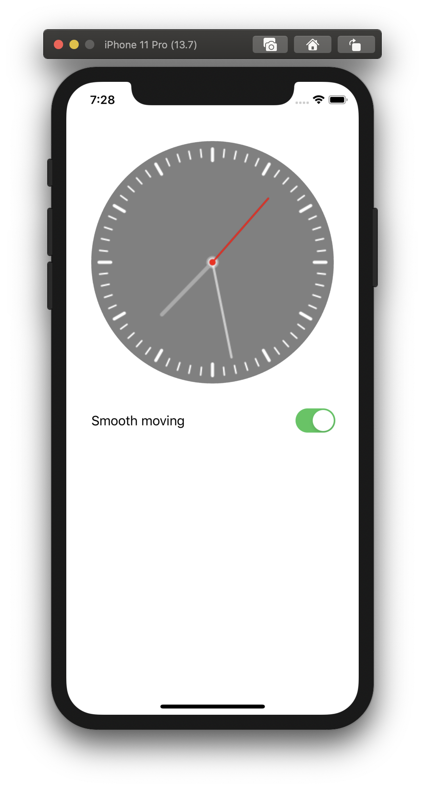

That is application which draws clock face based on CoreGraphics api. Sources here:

https://github.com/fizzy871/FSClock

#### Screenshots of code

###### CALayer subclass to draw clock hand. Uses UIBezierPath

-------

###### CALayer subclass to draw clock face. Do not use UIBezierPath

------

###### Code where time updates. Triggered by CADisplayLink, 24 frames per second.

-----

###### Final result

