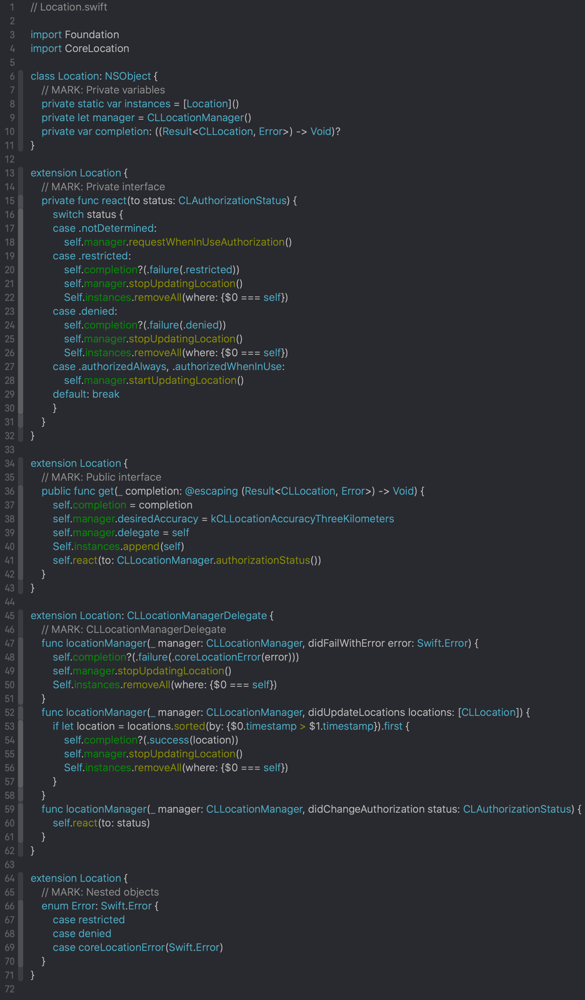
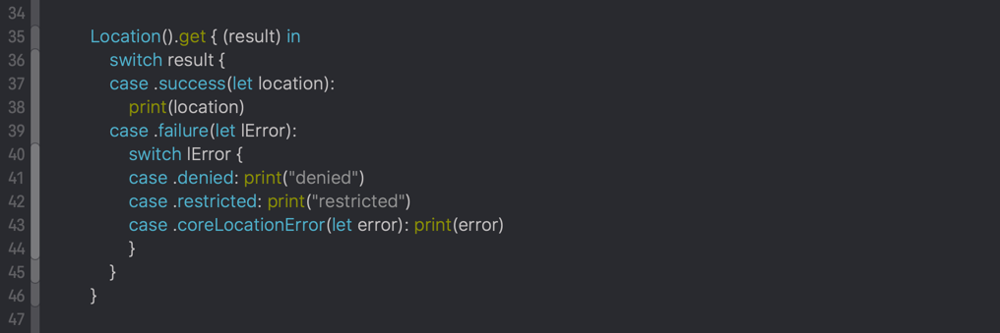
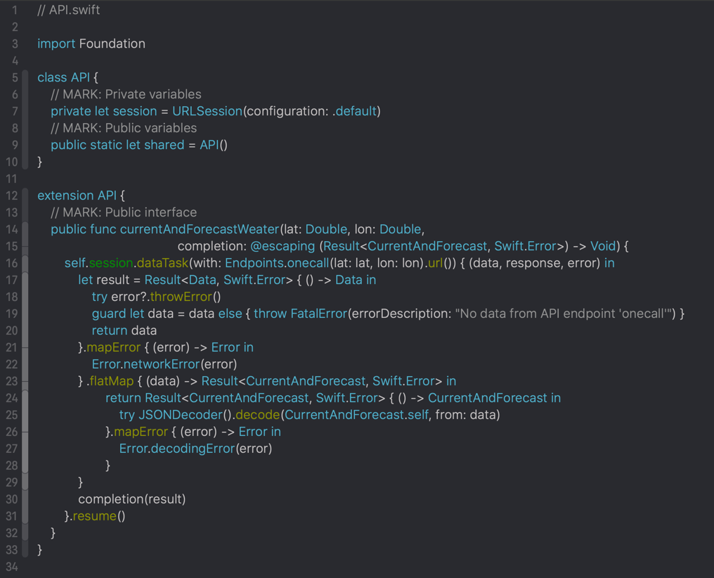
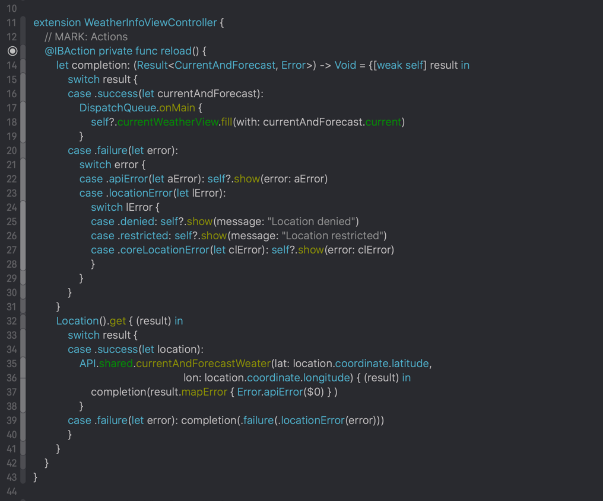

At free time I started to make simple weather forecast application. You can find sources of it here:

https://github.com/fizzy871/WeatherApp

It might help you understand how I organize my code.

Application do not have design. I planned to setup everything, make application show most of values it gets from the api and hire designer to prepare design for that application.

#### Screenshots of code

###### CoreLocation wrapper which gets current location once

###### usage

------

###### api manager

###### usage of both api manager and location wrapper in view controller

