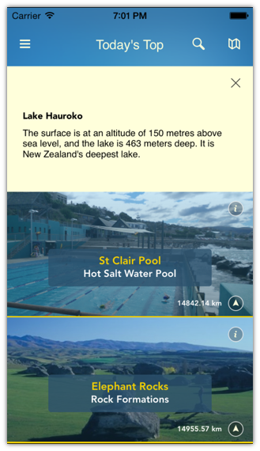
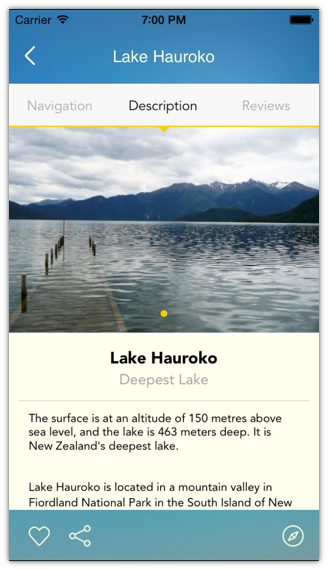
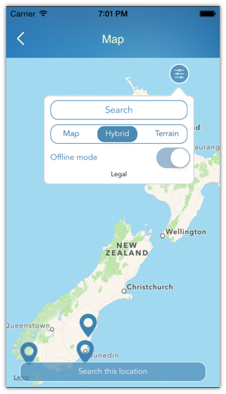
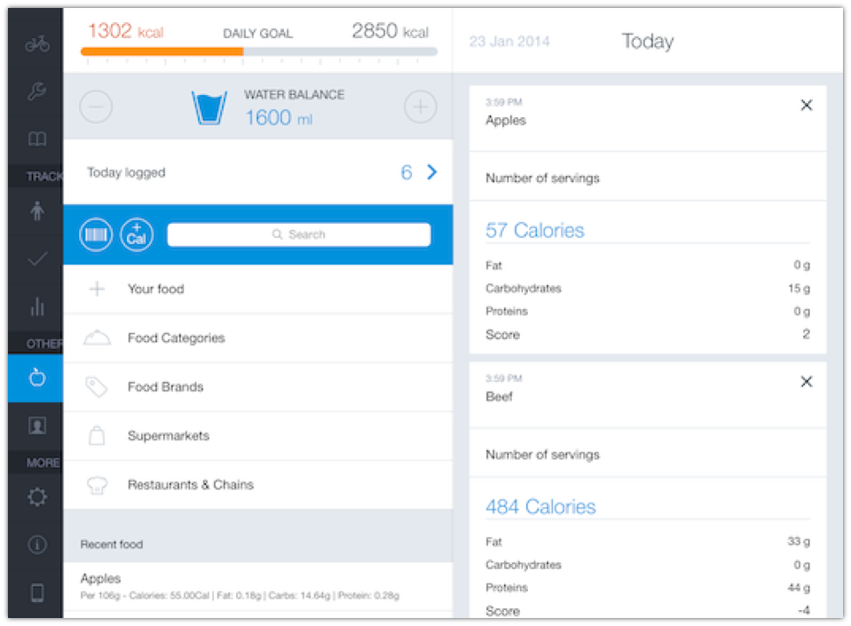
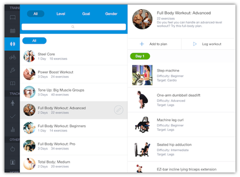
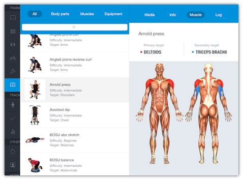

#Saechnikov Alexey

2011 - 2012  -  SharePoint Administrator ([http://learning.bsuir.by](http://learning.bsuir.by))  
2012 - 2013  -  iOS Developer ([VironIT](http://vironit.com))  
2013 - 2014  -  Senior iOS Developer ([VironIT](http://vironit.com))  
2014 - 2015  -  iOS Team Lead ([VironIT](http://vironit.com))  
2015 - current time  -  freelance iOS/OS X Developer ([personal site](http://saechnikov.com), [upwork](https://www.upwork.com/freelancers/~0164318e9deae07ccb))

[GitHub](https://github.com/fizzy871), [LinkedIn](https://www.linkedin.com/in/fizzy871), [Facebook](https://www.facebook.com/fizzy871)

## project examples
###[iTravelNZ](res/iTravelNZ/readme.md)
iPhone, iOS7+, redisign  

iTravelNZ® acts as a trusted and knowledgeable travel companion, one who knows all the best places to visit in spectacular New Zealand. It’s New Zealand in your pocket™! Identify and search for all the must-see attractions. Discover the best natural wonders in gorgeous Aotearoa.  
[App Store link](https://itunes.apple.com/app/id409098753)  
  

---
###[FitnessHD](res/FitnessHD/readme.md)  
iPad, iOS6+, as part of developers team  

Fitness for iPad takes all the guesswork out of your gym routine. Simply pick a workout according to your goal or level and follow the guidelines for each exercise. Easy-to-read graphs will clearly show your progress and the changes in your body parameters. With so many thought-out features, Fitness for iPad will become your portable personal trainer.  
[App Store link](https://itunes.apple.com/app/id788483284)  
  

---

####All projects by year

2013  
Checkvist client  
[iOS ads sdk (no desc)](res/iosAdsSDK/readme.md)  
[DemoApp (no desc)](res/DemoApp/readme.md)  
[FaceRecognition (no desc)](res/FaceRecognition/readme.md)  
[GooglePlus testing project (no desc)](res/GooglePlus/readme.md)  
[GifStory](res/GifStory/readme.md)  
LiveJournal client (OS X)

2014  
[FitnessHD](res/FitnessHD/readme.md)  
[iLook](res/iLook/readme.md)  
Simple calculator  
[taxiApp prototype](res/taxiApp/readme.md)  
[foodmastes prototype](res/foodmasters/readme.md)  
"Тренировка внимания"  
Flappy bird game clone  
ETB servers state checking app (OS X)

2015  
TimeSummary iOS client  
[Zenify](res/Zenify/readme.md)  
[workshop](res/workshop/readme.md)  
BoyGo/ManGo  
[iTravelNZ](res/iTravelNZ/readme.md)  
[RandomWords](res/RandomWords/readme.md)  
[MenuFire](res/MenuFire/readme.md)  
Finnyish  
[Multitran client](res/Multitran/readme.md)  
TVTap  

2016  
BelRoutes  
Vitim (iOS, OS X)