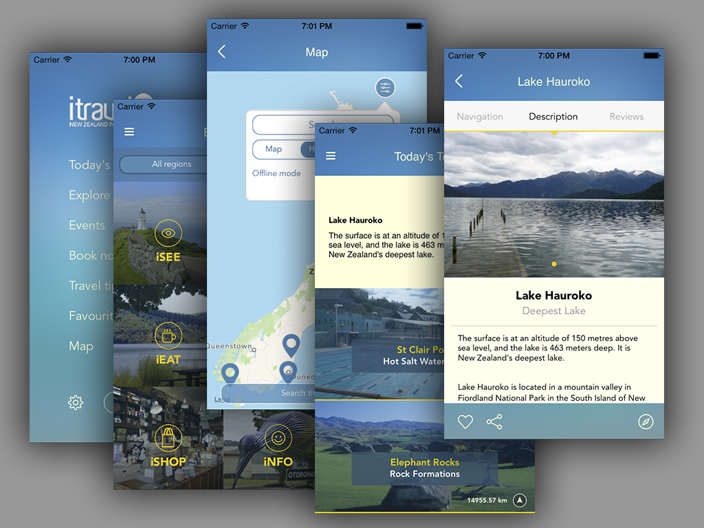
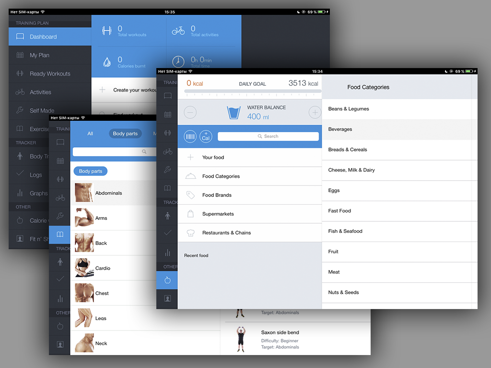
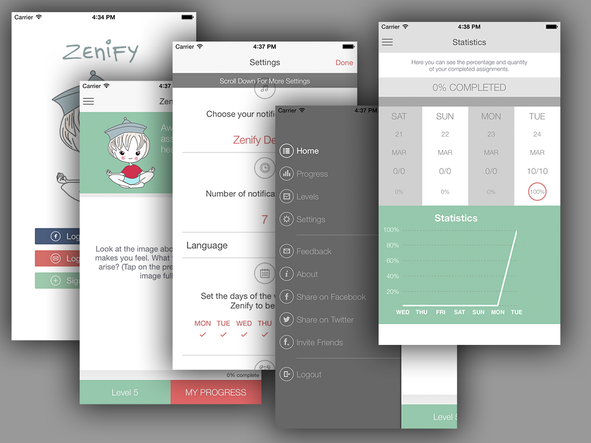
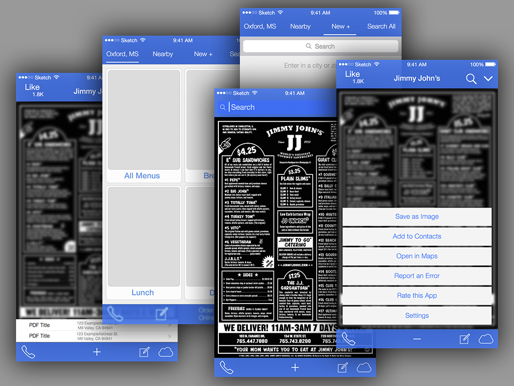

#Saechnikov Alexey

2011 - 2012  -  SharePoint Administrator ([http://learning.bsuir.by](http://learning.bsuir.by))  
2012 - 2013  -  iOS Developer ([VironIT](http://vironit.com))  
2013 - 2014  -  Senior iOS Developer ([VironIT](http://vironit.com))  
2014 - 2015  -  iOS Team Lead ([VironIT](http://vironit.com))  
2015 - current time  -  freelance iOS/OS X Developer ([personal site](http://saechnikov.com), [upwork](https://www.upwork.com/freelancers/~0164318e9deae07ccb))

[Personal site](http://saechnikov.com)  
[Upwork](https://www.upwork.com/freelancers/~0164318e9deae07ccb)   
[GitHub](https://github.com/fizzy871)  
[LinkedIn](https://www.linkedin.com/in/fizzy871)  
[Facebook](https://www.facebook.com/fizzy871)   

## Project examples
###[iTravelNZ](res/iTravelNZ/readme.md)
iPhone, iOS7+, redisign  

iTravelNZ® acts as a trusted and knowledgeable travel companion, one who knows all the best places to visit in spectacular New Zealand. It’s New Zealand in your pocket™! Identify and search for all the must-see attractions. Discover the best natural wonders in gorgeous Aotearoa.  
[App Store link](https://itunes.apple.com/app/id409098753)  
  
  

---
###[FitnessHD](res/FitnessHD/readme.md)  
iPad, iOS6+, as part of developers team  

Fitness for iPad takes all the guesswork out of your gym routine. Simply pick a workout according to your goal or level and follow the guidelines for each exercise. Easy-to-read graphs will clearly show your progress and the changes in your body parameters. With so many thought-out features, Fitness for iPad will become your portable personal trainer.  
[App Store link](https://itunes.apple.com/app/id788483284)  
  

---
###[Zenify](res/Zenify/readme.md)  
iPhone

Zenify teaches you how to live more mindfully and consciously through a variety of mindfulness meditation exercises delivered to your smart phone. These assignments teach you how to achieve a heightened state of awareness and enhanced consciousness of the present moment.  
[App Store link (free version)](https://itunes.apple.com/app/id886145246)  
[App Store link (paid version)](https://itunes.apple.com/app/id961136594)  
  

---
###[MenuFire](res/MenuFire/readme.md)  
iPhone, ios 7+, swift

Application for viewing nearby restaurants menus.
  

---

####All projects by year

####-- [VironIT](http://vironit.com) --  
2012 - 2013  
[iOS ads sdk (no desc)](res/iosAdsSDK/readme.md)  
[DemoApp (no desc)](res/DemoApp/readme.md)  
[FaceRecognition (no desc)](res/FaceRecognition/readme.md)  
[GooglePlus testing project (no desc)](res/GooglePlus/readme.md)  
[GifStory](res/GifStory/readme.md) ([link](http://vironit.com/portfolio/en/portfolio-item/social-networking-mobile-application/)) - as part of a team  
  
2014  
[FitnessHD](res/FitnessHD/readme.md) - as part of a team  
[iLook](res/iLook/readme.md)  
[taxiApp prototype](res/taxiApp/readme.md) - as project architector, team lead  
[foodmastes prototype](res/foodmasters/readme.md) - as project architector, team lead  
ETBook ([link](http://vironit.com/portfolio/en/portfolio-item/elearning-mobile-solution/)) - as part of a team  
ETBook servers state checking app (OS X)   
  
2015  
[Zenify](res/Zenify/readme.md) - as part of a team  
[workshop](res/workshop/readme.md) - as project architector  
  
####-- [MT Soft Garant Market](https://www.mtgarant.com/) --  
2016  
[Garant ECM](res/MTGarant/readme.md) ([link](https://www.mtgarant.com/en/product_ecm)) - as part of a team   
[Moscow City Duma](https://www.mtgarant.com/en/product_duma) - as part of a team  

####-- Freelance --  
2012 - 2013  
Checkvist client  
LiveJournal client (OS X)  

2014  
Simple calculator  
"Тренировка внимания"  
Flappy bird game clone 

2015  
TimeSummary iOS client  
BoyGo/ManGo  
[iTravelNZ](res/iTravelNZ/readme.md)  
[RandomWords](res/RandomWords/readme.md)  
[MenuFire](res/MenuFire/readme.md)  
Finnyish  
EmSee (https://lifehacker.ru/2015/09/26/emsee-dlya-ios-pozvolyaet-vybrat-bit-i-zapisat-pod-nego-rep/, https://itunes.apple.com/us/app/emsee-watch-share-create-freestyle/id1031048971?mt=8)  
[Multitran client](res/Multitran/readme.md)  
TVTap  

2016  
[BelRoutes](res/Belroutes/readme.md)  
[Vitim (iOS)](res/Vitim/ios/readme.md)  
[Vitim (OS X)](res/Vitim/osx/readme.md)  
[LaserApp](res/LyteRange/readme.md)  
[LaserApp2](res/LaserApp2/readme.md) 
[Wan2Get](res/Wan2Get/readme.md)  

2017  
CardZ  
CarbonFreeTravel  
modular application for gathering information  